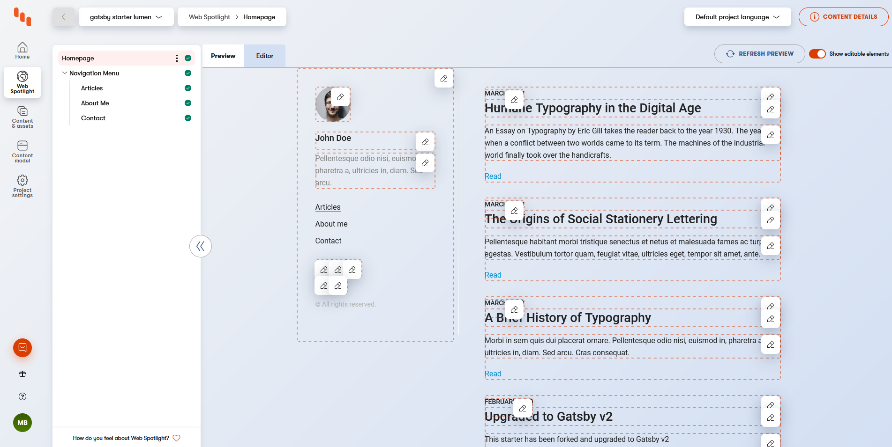

# Gatsby Starter Kontent Lumen

[](https://raw.githubusercontent.com/Kentico/gatsby-kontent-starter-lumen/master/LICENSE)
[](https://stackoverflow.com/tags/kentico-kontent)
[](https://gatsby-starter-kontent-lumen.netlify.com/)

[](https://app.netlify.com/sites/gatsby-starter-kontent-lumen/deploys)

Lumen is a minimal, lightweight and mobile-first starter for creating blogs using
[Gatsby](https://github.com/gatsbyjs/gatsby).

This is an edited clone of
[gatsby-starter-lumen](https://github.com/alxshelepenok/gatsby-starter-lumen) and [gatsby-v2-starter-lumen](https://github.com/GatsbyCentral/gatsby-v2-starter-lumen)
migrated for getting content from headless CMS
[Kontent](https://kontent.ai/).


## Features

+ Content from [Kontent](http://kontent.ai/) headless CMS.
+ Lost Grid ([peterramsing/lost](https://github.com/peterramsing/lost)).
+ Beautiful typography inspired by [matejlatin/Gutenberg](https://github.com/matejlatin/Gutenberg).
+ [Mobile-First](https://medium.com/@mrmrs_/mobile-first-css-48bc4cc3f60f) approach in development.
+ Stylesheet built using SASS and [BEM](http://getbem.com/naming/)-Style naming.
+ Syntax highlighting in code blocks.
+ Sidebar menu built using a configuration block.
+ Archive organized by tags and categories.
+ Automatic Sitemap generation.
+ Google Analytics support.

## Getting Started

### Requirements

+ [Node.js](https://nodejs.org/)

### Create codebase

1. Click on "Use this template" button to [create your own repository from this template](https://help.github.com/en/github/creating-cloning-and-archiving-repositories/creating-a-repository-from-a-template).

### Create content source

1. Go to [app.kontent.ai](https://app.kontent.ai) and [create empty project](https://docs.kontent.ai/tutorials/set-up-kontent/projects/manage-projects#a-creating-projects)
1. Go to "Project Settings", select API keys and copy
    + Project ID
1. Install [Kontent Backup Manager](https://github.com/Kentico/kontent-backup-manager-js) and import data to newly created project from [`kontent-backup.zip`](./kontent-backup.zip) file (place appropriate values for `apiKey` and `projectId` arguments):

    ```sh
    npm i -g @kentico/kontent-backup-manager

    kbm --action=restore --apiKey=<Management API key> --projectId=<Project ID> --zipFilename=kontent-backup
    ```

    > Alternatively, you can use the [Template Manager UI](https://kentico.github.io/kontent-template-manager/import-from-file) for importing the content.

1. Go to your Kontent project and [publish all the imported items](https://docs.kontent.ai/tutorials/write-and-collaborate/publish-your-work/publish-content-items).

### Join codebase and content data

Copy [`.env.template`](`./.env.template`) and name it `.env` then set the `KONTENT_PROJECT_ID` environment variable to value from Kontent -> "Project Settings" ->  API keys -> Project ID.

> This step could be done automatically by running `npm run prepare-environment` command defined in `package.json`.

**You are now ready to use the site as your own!**

## Development

Install the dependencies and run development environment

```sh
npm install  
npm run prepare-environment # Creates a .env file from .env.template file if no .env file exists
npm run develop
```

## Site production build

Install the dependencies and run production build

```sh
npm install
npm run prepare-environment # Creates a .env file from .env.template file if no .env file exists
npm run build
```

### Preview Deploy

To allow this example load unpublished content via  [Preview Delivery API](https://docs.kontent.ai/reference/delivery-api#section/Production-vs.-Preview), you just need to adjust `.env` file created in ["Join codebase to content data"](#Join-codebase-and-content-data) section by setting these environment variables:

+ KONTENT_PREVIEW_KEY=`<PREVIEW_API_KEY>`by passing the [Preview authentication key](https://docs.kontent.ai/reference/delivery-api#section/Authentication)
+ KONTENT_PREVIEW_KEY=`true`

You could also walk through the [Getting started with Gatsby Cloud and Kontent](https://www.gatsbyjs.com/cloud/docs/kontent/getting-started) to set up your Preview environment on [Gatsby Cloud](https://www.gatsbyjs.com/) plus enjoy the bonus in form of [incremental builds](https://www.gatsbyjs.com/cloud/docs/incremental-builds/).

If you are more fan of [Netlify](https://www.netlify.com/), you could follow [Deploy to Netlify section](#Deploy-with-Netlify) and then provide the [Environment variables](https://docs.netlify.com/configure-builds/environment-variables/) mentioned above in Netlify.

#### Preview URLs

Once you've got your app running in a preview environment, you need to specify where (URL-wise) each type of your content can be accessed and viewed. For example, imagine your app runs at https://preview.example.com so you want to open "Project Settings", and select "Preview URLs" set it like this:

+ `Article`: `https://preview.example.com/articles/{URLslug}`
+ `Author`: `https://preview.example.com`
+ `Category`: `https://preview.example.com/categories/{URLslug}`
+ `Menu`: `https://preview.example.com`
+ `Menu Item`: `https://preview.example.com/{URLslug}`
+ `Tag`: `https://preview.example.com/tags/{URLslug}`

> If you are using more complex and nested menu navigation, use example of the [Gatsby Navigation example](https://github.com/Kentico/kontent-gatsby-packages/tree/master/examples/navigation#readme). In a nutshell, you want to register routes endpoint i.e. `/preview/<LANGUAGE>/<CODENAME>` to the same page as was registered for `normal` URL.

### Production Deploy

Before deploying to production add own google analytics `trackingId` to [`gatsby-config.js`].

## Deploy with Netlify

Netlify can run in any frontend web environment, but the quickest way to try it out is by running it on a pre-configured starter site with Netlify. Use the button below to build and deploy your own copy of the repository:

[](https://app.netlify.com/start/deploy?repository=https://github.com/kentico/gatsby-starter-kontent-lumen)

After clicking that button, you’ll authenticate with GitHub and choose a repository name. Netlify will then automatically create a repository in your GitHub account with a copy of the files from the template. Next, it will build and deploy the new site on Netlify, bringing you to the site dashboard when the build is complete. Next, you’ll need to set up Netlify’s Identity service to authorize users to log in to the CMS.

> If you want to use [Incremental builds](https://www.netlify.com/blog/2020/04/23/enable-gatsby-incremental-builds-on-netlify/), you need to enable [Build Plugins Beta](https://docs.netlify.com/configure-builds/build-plugins/#enable-build-plugins-beta) for your site.

> If you want to deploy your own copy of the gatsby-lumen-starter project, in the netlify.toml file modify the `KONTENT_PROJECT_ID` environment variable to match the value from your Kontent project's "Project Settings" ->  API keys -> Project ID, or [set the Netlify environment variables](https://docs.kontent.ai/tutorials/develop-apps/integrate/netlify#a-set-netlify-environment-variables) through the Netlify UI.

## Folder Structure

```
└── src
    ├── assets
    │   ├── fonts
    │   │   └── fontello-771c82e0
    │   │       ├── css
    │   │       └── font
    │   └── scss
    │       ├── base
    │       ├── mixins
    │       └── pages
    ├── components
    │   ├── Article
    │   ├── ArticleTemplateDetails
    │   ├── CategoryTemplateDetails
    │   ├── Links
    │   ├── Layout
    │   ├── Menu
    │   ├── PageTemplateDetails
    │   ├── Sidebar
    │   └── TagTemplateDetails
    ├── pages
    └── templates
```

## Implementing Web spotlight

This example is ready to be used with [Web Spotlight](https://webspotlight.kontent.ai/) functionality. If you want to explore the possibilities, take a look to the [Web Spotlight tutorial](/docs/WEB-SPOTLIGHT.md)!



